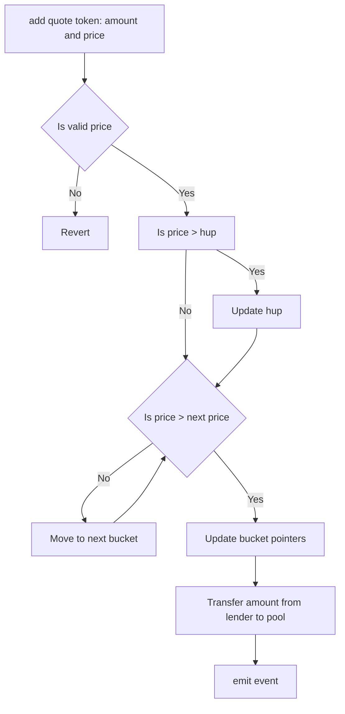

# ajna contracts

Ajna contracts

# Development

Install Foundry [instructions](https://github.com/gakonst/foundry/blob/master/README.md#installation)  then, install the [foundry](https://github.com/gakonst/foundry) toolchain installer (`foundryup`) with:

```bash
curl -L https://foundry.paradigm.xyz | bash
```

To get the latest `forge` or `cast` binaries, tun

```bash
foundryup
```

#### Project Setup

```bash
make all
```

#### Build

```bash
make build
```

#### Run Tests

```bash
make test
```

## Brownie integration

- Install Brownie [instructions](https://eth-brownie.readthedocs.io/en/stable/install.html)
- Make a copy of .env.example and name it .env. Add the values for ETHERSCAN_TOKEN and WEB3_INFURA_PROJECT_ID
- Run `brownie console`

### Brownie integration tests

```bash
brownie test
```

### ERC20 pool manual test

- Running following command will deploy ERC20 MKR/DAI pool
  - 1 lender funded with 1000000 DAI
  - lender deposits 100000 DAI in each bucket with 4000, 2000, 1500, 1000 price
  - 5 borrowers funded with 500 MKR each and depositing 1500 MKR as collateral (borrower1 - 100 MKR, borrower2 - 200 MKR, borrower3 - 300 MKR, borrower4 - 400 MKR, borrower5 - 500 MKR, )
  - borrower1 borrows 100000 DAI from hup (4000)
  - borrower2 borrows 100000 DAI from next hup (2000)

```bash
>>> lender, borrower1, borrower2, borrower3, borrower4, borrower5, dai, mkr, pool = run('erc20setup')
>>> mkr.balanceOf(pool)
1500000000000000000000
>>> dai.balanceOf(pool)
200000000000000000000000
>>> dai.balanceOf(borrower1)
100000000000000000000000
>>> dai.balanceOf(borrower2)
100000000000000000000000
```

# Functionality

## Bucket

- no bucket is preallocated
- each bucket contains a pointer to next bucket price
- next price pointer is updated when new deposit occurs at a price between current bucket price and next price

```code
    struct Bucket {
        uint256 price; // current bucket price
        uint256 next; // next utilizable bucket price
        uint256 amount; // total quote deposited in bucket
        uint256 debt; // accumulated bucket debt
    }
```

## addQuoteToken

- lender should provide a valid price to deposit quote token at
- can only move HUP up and never down
- no debt reallocation occurs
- if lending at a higher price than HUP then HUP is updated accordingly
- next HUP pointer is updated for each price bucket where case



## BorrowOrder

```code
    struct BorrowOrder {
        uint256 amount; // amount to borrow
        uint256 price; // borrow at price
    }
```

## borrow

- can only move HUP down and never up
- borrower should call borrow method with a sorted array of BorrowOrder objects representing a tuple of amount and next HUP
- if not enough amount on deposit to complete an order then transaction will fail
- collateral encumbered is calculated at the new HUP set by borrow action (that is the lowest price bucket used to complete the loan)
